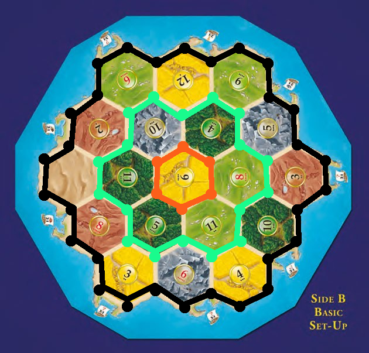
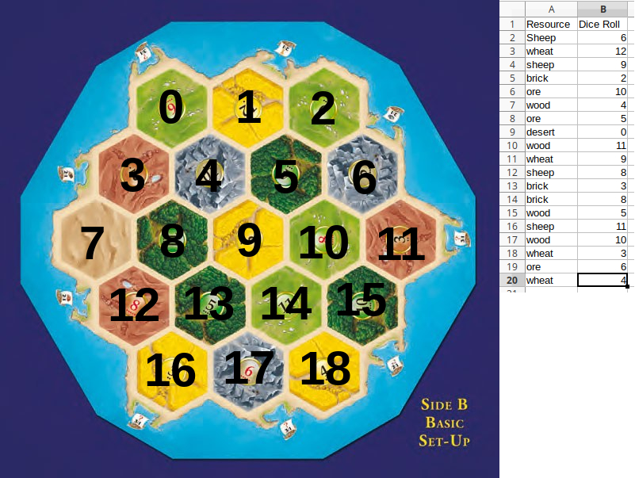

# CatanPicker
## A tool to help beginning players pick the best starting location based on the dice possibilities.

### Intro:
Catan is a resource management game, where the goal is to utilize resources to maximize production and be the first to get 10 victory points. VPs can be won in a variety of different ways. Building settlements give you 1 VP, upgrading those to cities gives you 2 VP, Development cards, building the longest road, and having the largest army also contribute to your VP count.

### Files:
#### catanPicker.py
  This file contains the main portion of the code.
  
    1. Pulls in catanBoard.csv, and neighbors.csv.
    2. Verifies if the catanBoard.csv inputted is the correct format.
    3. Stores the neighbors into 3 lists, each list comprising of lists which hold the vertex's "coordinates". These coordinates represent the 3 neighboring hexs. Each one of the 3 lists, represents a ring around the board, as seen below.
   
#### catanBoard.csv
  Contains the board information. Column 1 has the resources, and column 2 has the dice roll number.
#### neighbors.csv
  Contains the each vertex by hex. It should be noted, that the neighbors are listed from left to right.
  
  
